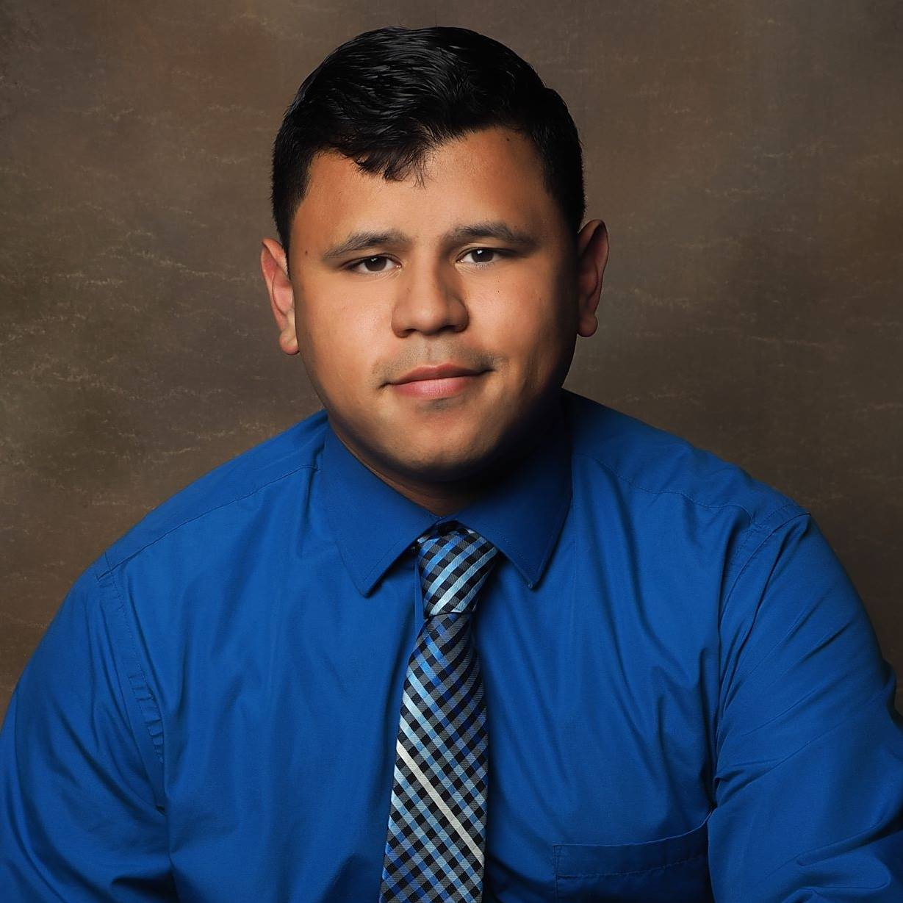
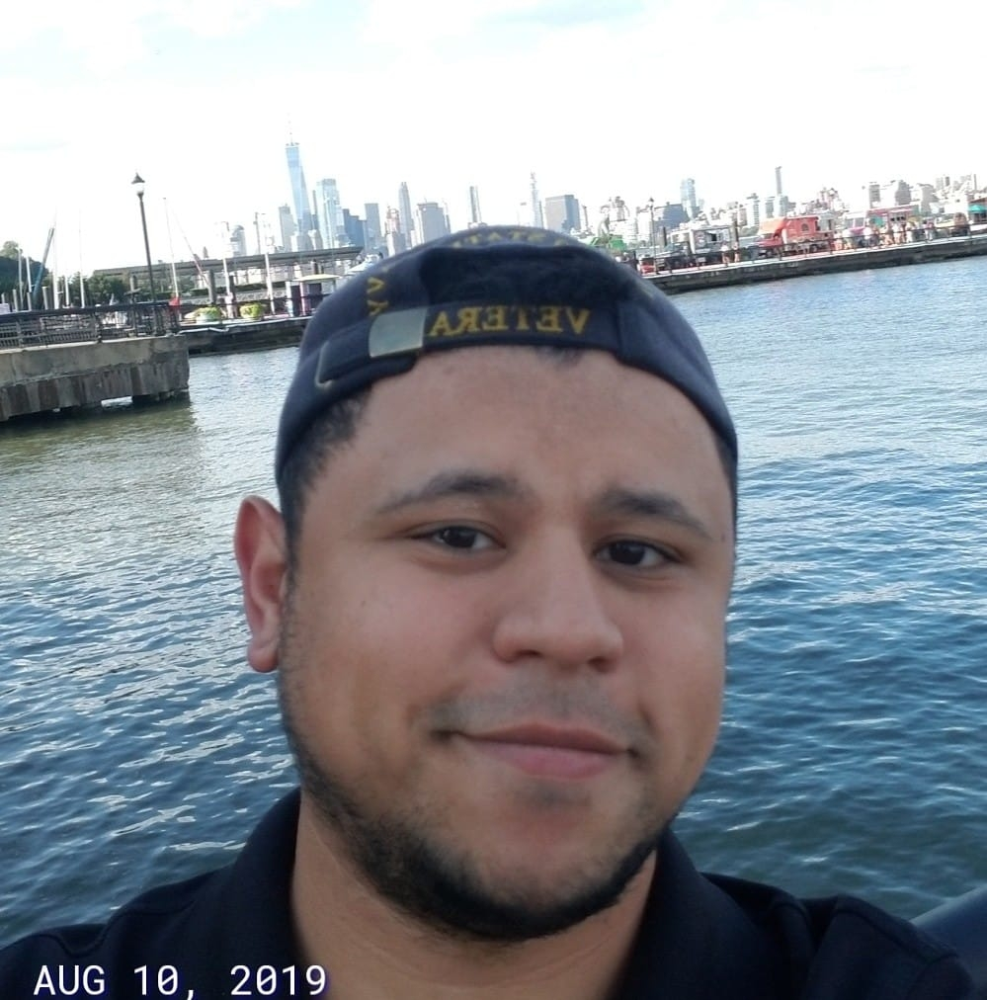

# About-Me
My name is Marc Calo. This is an about me page that I will be updating as learn javascript and develop my business and career.

I started a Javascript class at Code Immersives in Hell's Kitchen NY January of 2020.  I've been growing a small finanical services business since October of 2015 while attending school partime. Prior to that I enlisted in the United States Navy from 2010-2014 shortly after highschool.

My goals for the term future are as follows:

 1. to become proficient in javascript and pyhton
 2.  Open 2 LLCs 
 3. Pass my series 65
 4.  create programs geared towards trading the financial markets
 5.obtain a degree in data science
 6. Gain experience in a hedge fund environment
 7. Run or open a hedge fund
 8. Continue to code and improve skillset to apply to financial markets

 My hobbies are interests include but are not limited to: 

 * Financial Markets
 * Coding
 * Cyber Security
 * Blockchain Technology 
 * Risk Mangement
 * Trading
 * Poker 
 * learning new things

Here are all links to my other profiles

